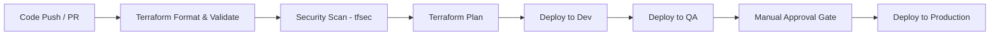

# Multi-Environment Azure 3tier Infrastructure Setup

An enterprise-grade, 3-tier Azure infrastructure provisioned using modular Terraform code and automated with Azure DevOps CI/CD pipelines across Development, QA/Staging, and Production environments.

## Overview

This repository provides an automated, secure, and scalable Infrastructure as Code (IaC) setup for deploying multi-tier applications on Microsoft Azure. It demonstrates enterprise cloud architecture patterns, security compliance, network isolation, and automated CI/CD deployment workflows.

### Key Objectives
* **Multi-Environment Isolation**: Segregated environments for `dev`, `qa`, and `prod` with environment-specific configurations.
* **Infrastructure as Code (IaC)**: Reusable, modular Terraform definitions for consistent deployment.
* **Automated CI/CD**: End-to-end Azure DevOps pipelines with validation, security scanning, and manual approval gates.
* **Network & Security**: VNet isolation, Private Endpoints, Azure Bastion, Azure Key Vault, and Azure NAT Gateway.
* **High Availability**: Load balancing via Application Gateway (Layer 7) and Internal Load Balancer (Layer 4).
* **Automated Testing**: Terratest integration for infrastructure verification.

---

## Architecture


---

## Core Components

| Layer / Category | Azure Services & Tools |
| --- | --- |
| **Networking** | Virtual Network (VNet), Subnets, Network Security Groups (NSGs), Azure NAT Gateway, Private Endpoints |
| **Traffic Management** | Application Gateway (Layer 7), Internal Load Balancer (Layer 4) |
| **Compute** | Frontend & Backend Virtual Machines |
| **Security & Secrets** | Azure Bastion Host, Azure Key Vault |
| **Database** | Azure SQL Server & Azure SQL Database |
| **Monitoring** | Azure Monitor & Log Analytics Workspace |
| **Automation & Testing** | Terraform, Azure DevOps Pipelines, Terratest |

---

## Environment Strategy

* **Development (`dev`)**: Sized for rapid testing, cost-efficiency, and frequent deployments.
* **QA / Staging (`qa`)**: Mirror of production environment for validation, UAT, and release testing.
* **Production (`prod`)**: Configured for high availability, security hardening, and business-critical workloads.

---

## CI/CD Pipeline Workflow



### Pipeline Features
* Terraform syntax formatting and validation check.
* Security scanning using `tfsec`.
* Automated deployment across Dev and QA environments.
* Production governance with manual approval gates.
* Centralized state backend management in Azure Storage.

---

## Repository Structure

```text
.
├── Environment/
│   ├── dev/                  # Development environment configuration
│   ├── qa/                   # QA/Staging environment configuration
│   └── prod/                 # Production environment configuration
├── Module/
│   ├── azurerm_application_gateway/
│   ├── azurerm_bastion/
│   ├── azurerm_database/
│   ├── azurerm_internal_loadbalancer/
│   ├── azurerm_nat_gateway/
│   ├── azurerm_niclb_association/
│   ├── azurerm_publicip/
│   ├── azurerm_resource_group/
│   ├── azurerm_virtual_machine/
│   └── azurerm_virtual_network/
├── Pipeline/
│   ├── dev.yml               # Dev deployment pipeline definition
│   ├── qa.yml                # QA deployment pipeline definition
│   ├── prod.yml              # Prod deployment pipeline definition
│   └── multi-env.yml         # Multi-environment pipeline workflow
├── Test/
│   ├── terra_test.go         # Terratest automated infrastructure test cases
│   ├── go.mod
│   └── go.sum
└── README.md
```

---

## Deployment Guide

### Prerequisites
* [Azure CLI](https://docs.microsoft.com/en-us/cli/azure/install-azure-cli) installed
* [Terraform CLI](https://developer.hashicorp.com/terraform/downloads) (v1.0+)
* Active Azure Subscription

### Step-by-Step Instructions

1. **Clone the Repository**
   ```bash
   git clone https://github.com/Pjaisw1103/Multi-Environment-Azure-Infrastructure-Setup.git
   cd Multi-Environment-Azure-Infrastructure-Setup
   ```

2. **Authenticate with Azure**
   ```bash
   az login
   ```

3. **Deploy Target Environment**
   ```bash
   # Navigate to the target environment directory
   cd Environment/dev

   # Initialize Terraform backend & modules
   terraform init

   # Validate configuration syntax
   terraform validate

   # Review execution plan
   terraform plan

   # Apply infrastructure resources
   terraform apply
   ```

4. **Run Infrastructure Verification Tests (Optional)**
   ```bash
   cd ../../Test
   go test -v -timeout 30m
   ```

---

## Author

**Priya Jaiswal**  
Azure Cloud | DevOps | Terraform

* GitHub: [@Pjaisw1103](https://github.com/Pjaisw1103)
* LinkedIn: [Priya Jaiswal](https://linkedin.com/in/priya-jaiswal1103)
